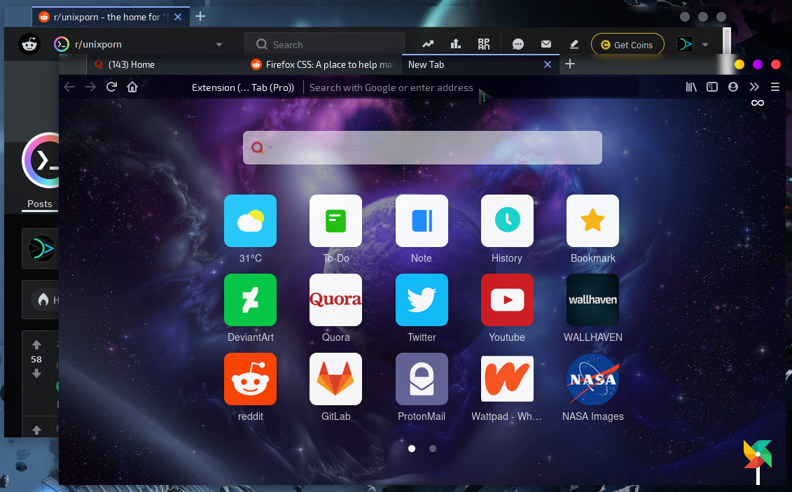

# GlassyFox
## Tema untuk browser Firefox

## *What the heck is this?*
GlassyFox terdiri dari berkas `userChrome.css` yang digunakan untuk kustomisasi broser Firefox, dari warna ataupun *layout* peramban Firefox.

## Cara Pakai
### Prasyarat
Sebelum bisa memakai tema kustom, lakukan langkah-langkah berikut:
1. Pada Firefox, buka `about:config` lewat urlbar.
2. Akan tampil laman konfirmasi, langsung saja tekan `Accept the Risk and Continue` dan jadilah pahlawan!
3. Cari satu persatu parameter berikut dan ubah semua nilai masing-masing menjadi **`true`**: 
 - **`toolkit.legacyUserProfileCustomizations.stylesheets`**
 - **`layers.acceleration.force-enabled`**
 - **`gfx.webrender.all`**
 - **`svg.context-properties.content.enabled`**
4. Sekarang buka direktori profil Firefox. Untuk mengetahui letaknya, lakukan langkah berikut:
 - Buka `about:support`
 - Perhatikan tabel, pada kolom **Profile Folder** tekan `Open Directory`. Inilah direktori profil Firefox.
5. Pada direktori profil, buat folder baru bernama `chrome`.

### Anjuran Pemakaian:
Untuk kepuasan maksimal, lakukan kustomisasi berikut melalui Firefox Menu -> Customization.
Atur agar:
 - Density = Compact
 - Theme = Dark
 - Sebaiknya nonaktifkan Bookmatk toolbar

Kerja bagus, untuk menggunakan tema, tinggal tempatkan berkas `userChrome.css` (dan `userContent.css`) ke folder `chrome` tadi.

## Fitur dasar GlassyFox:
1. Tabbar, toolbar, urlbar, dll transparan
2. *Autohide* toolbar
3. *Close tab button on hover*
4. dan lain-lain...

## Kustomisasi sendiri
Bagi yang kurang *sreg* dengan warna maupun fitur tertentu dan ingin mengubah sedikit, bisa disunting sendiri file `userChrome.css`-nya. 
Agar mudah disunting sesuai selera, dalam kode css kebanyakan nilai tersedia variabel seperti warna dan *corner-radius*, juga komentar untuk beberapa fitur dan bagian yang diatur.

## Catatan
Baru dites dengan Firefox 78 pada Manjaro Linux/KDE Plasma.